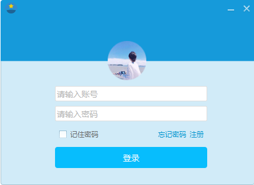

[toc]

# 自定义标题栏以及基础窗口类的设计（扩展性强）

## 自定义标题栏

1、TitleBar的设计

一般来说标题栏主要有【图标显示】、【缩小、还原/放大、关闭】以及【鼠标拖动功能】三大功能


### 缩小,还原/放大,关闭按钮布局

对于【图标显示】以及【缩小、还原/放大、关闭】功能，可以将其看作一个widget，在窗口的开始部分将图标(icon)、titleContent以及各种按钮放在一个水平布局中，在此要注意的是可以将icon和各种按钮的宽高具体设置，而`titleContent设置为水平可扩展，垂直固定`，这样就可以完整的填充Title部分

```cpp
void TitleBar::initControl() {
	m_pIcon = new QLabel(this);
	m_pTitleContent = new QLabel(this);

	m_pButtonMin = new QPushButton(this);
	m_pButtonRestore = new QPushButton(this);
	m_pButtonMax = new QPushButton(this);
	m_pButtonClose = new QPushButton(this);

	//按钮设置固定大小
	m_pButtonMin->setFixedSize(QSize(BUTTON_WIDTH, BUTTON_HEIGHT));
	m_pButtonRestore->setFixedSize(QSize(BUTTON_WIDTH, BUTTON_HEIGHT));
	m_pButtonMax->setFixedSize(QSize(BUTTON_WIDTH, BUTTON_HEIGHT));
	m_pButtonClose->setFixedSize(QSize(BUTTON_WIDTH, BUTTON_HEIGHT));

	//设置对象名
	m_pTitleContent->setObjectName("TitleContent");
	m_pButtonMin->setObjectName("ButtonMin");
	m_pButtonRestore->setObjectName("ButtonRestore");
	m_pButtonMax->setObjectName("ButtonMax");
	m_pButtonClose->setObjectName("ButtonClose");

	//设置布局
	QHBoxLayout* mylayout = new QHBoxLayout(this);//水平布局
	mylayout->addWidget(m_pIcon);
	mylayout->addWidget(m_pTitleContent);
	mylayout->addWidget(m_pButtonMin);
	mylayout->addWidget(m_pButtonRestore);
	mylayout->addWidget(m_pButtonMax);
	mylayout->addWidget(m_pButtonClose);

	mylayout->setContentsMargins(5, 0, 0, 0);	//设置布局间隙（和窗口边框）
	mylayout->setSpacing(0);					//设置部件间的间隙 
	//标题内容的尺寸策略，就和我们现在正在使用应用一样（水平可以扩展，垂直方向固定）
	m_pTitleContent->setSizePolicy(QSizePolicy::Expanding, QSizePolicy::Fixed);
	setFixedHeight(TITLE_HEIGHT);			//设置标题栏高度
	//将标题部分的边框去除
	setWindowFlags(Qt::FramelessWindowHint);//窗体风格采用无边框
}
```

### 缩小,还原/放大,关闭按钮功能

要注意的是，如果要让Title适用于更多窗口并且符合窗口的设计的话，我们在设计这些功能的时候，在点击按钮时，更多的是发送信号，然后在对应的窗口中进行信号与槽的连接👇

```cpp
//初始化标题栏
void BasicWindow::initTitleBar(ButtonType buttonType) {
	_titleBar = new TitleBar(this);
	_titleBar->setButtonType(buttonType);//设置按钮类型
	_titleBar->move(0, 0);				//将窗口调整到0，0(相对于父部件)

	//各个信号与槽连接的建立
	connect(_titleBar, SIGNAL(signalButtonMinClicked()), this, SLOT(onButtonMinClicked()));
	connect(_titleBar, SIGNAL(signalButtonRestoreClicked()), this, SLOT(onButtonRestoreClicked()));
	connect(_titleBar, SIGNAL(signalButtonMaxClicked()), this, SLOT(onButtonMaxClicked()));
	connect(_titleBar, SIGNAL(signalButtonCloseClicked()), this, SLOT(onButtonCloseClicked()));

}
```

`缩小功能onButtonMinClicked()`

```cpp
//最小化按钮
void BasicWindow::onButtonMinClicked() {
    //Qt::Tool是WindowFlags，可以通过setWindowFlags(Qt::Tool);来进行设置
    //它的意思就是说这个窗口是个工具窗口它通常是一个用于显示工具按钮的小窗口，这样是不用最小化的，只要进行hide就好
    //我们可以使用"|"符号对flag进行设置，比如setWindowFlags(Qt::Tool|Qt::FramelessWindowHint);
	if (Qt::Tool == (windowFlags() & Qt::Tool)) {				
		hide();
	}
	else {
        //最小化
		showMinimized();
	}
}
```

hide()以后，可以通过show，对窗口重新进行显示。

最小化：


`还原功能onButtonRestoreClicked()`

```cpp
void BasicWindow::onButtonRestoreClicked() {
	QPoint windowPos;
	QSize windowSize;
	//获取到原来的窗口的位置以及大小进行设置
	_titleBar->getRestoreInfo(windowPos, windowSize);
	//设置几何属性,设置位置以及大小
	setGeometry(QRect(windowPos, windowSize));
}

```

`放大功能onButtonMaxClicked()`

```cpp
void BasicWindow::onButtonMaxClicked() {
    //先保存好原始的位置
	_titleBar->saveRestoreInfo(pos(), QSize(width(), height()));
	//获取可用的桌面可用大小
    QRect desktopRect = QApplication::desktop()->availableGeometry();
	//进行大小位置调整
    QRect factRect = QRect(desktopRect.x() - 3, desktopRect.y() - 3,
		desktopRect.width() + 6, desktopRect.height() + 6);
	//对窗口进行设置
    setGeometry(factRect);
}
```


### 鼠标拖动部分

```cpp
//移动窗口事件（通过鼠标按下鼠标移动鼠标释放实现拖动标题栏实现移动窗口效果）
void TitleBar::mousePressEvent(QMouseEvent*event) {
	if (m_buttonType == MIN_MAX_BUTTON) {
		//在窗口最大化时禁止拖动
		if (m_pButtonMax->isVisible()) {
			m_isPressed = true;
			m_startMovePos = event->globalPos();  //globalPos();返回事件发生时鼠标的全局位置
		}
	}
	else {
		m_isPressed = true;
		m_startMovePos = event->globalPos();
	}

	return QWidget::mousePressEvent(event);
}

//鼠标移动事件
void TitleBar::mouseMoveEvent(QMouseEvent* event) {
	if (m_isPressed) {
		//鼠标全局坐标相对于原来偏移了多少
		QPoint movePoint = event->globalPos() - m_startMovePos;
		//获取父部件的全局坐标
		QPoint widgetPos = parentWidget()->pos();
		m_startMovePos = event->globalPos();
		parentWidget()->move(widgetPos.x() + movePoint.x(), widgetPos.y() + movePoint.y());//父部件进行移动
		//parentWidget()->move(movePoint.x(), movePoint.y());//父部件进行移动
		//qDebug() << "parentWidget()->pos();" << widgetPos.x() << " " << widgetPos.y();
		//qDebug() << "global;" << event->globalPos().x() << " " << event->globalPos().y();
	}
	return QWidget::mouseMoveEvent(event);
}

//鼠标释放事件
void TitleBar::mouseReleaseEvent(QMouseEvent* event) {
	m_isPressed = false;
	return QWidget::mouseReleaseEvent(event);
}
```


需要注意的是：

①当点击按钮触发的时候要保存好m_startMovePos原本的鼠标对于全局的坐标，并将isPressed设置为true

②通过按钮类型的设置来判断是否可以进行放大缩小，也是为了扩展性

```cpp
//枚举值
enum ButtonType {
	MIN_BUTTON = 0,		//最小化及关闭按钮
	MIN_MAX_BUTTON,		//最小化，最大化及关闭按钮
	ONLY_CLOSE_BUTTON	//只有关闭按钮
};
```


## 基础窗口的设计

基础窗口设计主要的原因就是为了当创建各个窗口时，都可以基于此窗口进行扩展（作为父类），要作为基础窗口，所要具有的功能有：

①集成TitleBar的功能

②窗口拖动功能

③和TitleBar信号相对应的槽函数（缩小，还原/放大，放大）

④加载样式表功能

### 集成TitleBar的功能

将TitleBar作为成员，并提供初始化功能

```cpp
void BasicWindow::initTitleBar(ButtonType buttonType) {
	_titleBar = new TitleBar(this);
	_titleBar->setButtonType(buttonType);//设置按钮类型
	_titleBar->move(0, 0);				//将窗口调整到0，0(相对于父部件)

	//各个信号与槽连接的建立
	connect(_titleBar, SIGNAL(signalButtonMinClicked()), this, SLOT(onButtonMinClicked()));
	connect(_titleBar, SIGNAL(signalButtonRestoreClicked()), this, SLOT(onButtonRestoreClicked()));
	connect(_titleBar, SIGNAL(signalButtonMaxClicked()), this, SLOT(onButtonMaxClicked()));
	connect(_titleBar, SIGNAL(signalButtonCloseClicked()), this, SLOT(onButtonCloseClicked()));
}
```

### 窗口拖动功能

和TitleBar的移动功能类似（移动时就可以不用移动父部件，移动自身就行），只是，这次拖动的对象是窗口而不是标题栏

```cpp
void BasicWindow::mouseMoveEvent(QMouseEvent* event) {
	//按下了，且按下的是（左键(event->button() && Qt::LeftButton)）
	if (m_mousePressed && (event->buttons() && Qt::LeftButton)) {
		move(event->globalPos() - m_mousePoint);//event->globalPos()用于返回事件发生时候的全局坐标（相对于屏幕左上角）
		event->accept();
	}
}

//鼠标按下事件
void BasicWindow::mousePressEvent(QMouseEvent* event) {
	if (event->button() == Qt::LeftButton) {
		m_mousePressed = true;
		//pos:事件发生时相对于窗口左上角的偏移坐标
		m_mousePoint = event->globalPos() - pos();
		event->accept();
	}
}

//鼠标释放事件
void BasicWindow::mouseReleaseEvent(QMouseEvent*event) {
	m_mousePressed = false;
}
```


### TitleBar信号相对应的槽函数

```cpp
//初始化标题栏
void BasicWindow::initTitleBar(ButtonType buttonType) {
	...
    ...
    ...
	//各个信号与槽连接的建立
	connect(_titleBar, SIGNAL(signalButtonMinClicked()), this, SLOT(onButtonMinClicked()));
	connect(_titleBar, SIGNAL(signalButtonRestoreClicked()), this, SLOT(onButtonRestoreClicked()));
	connect(_titleBar, SIGNAL(signalButtonMaxClicked()), this, SLOT(onButtonMaxClicked()));
	connect(_titleBar, SIGNAL(signalButtonCloseClicked()), this, SLOT(onButtonCloseClicked()));

}

//最小化按钮
void BasicWindow::onButtonMinClicked() {
	if (Qt::Tool == (windowFlags() & Qt::Tool)) {				
		hide();
	}
	else {
		showMinimized();
	}
}

void BasicWindow::onButtonRestoreClicked() {
	QPoint windowPos;
	QSize windowSize;
	//获取到原来的窗口的位置以及大小进行设置
	_titleBar->getRestoreInfo(windowPos, windowSize);
	//设置几何属性
	setGeometry(QRect(windowPos, windowSize));
}

void BasicWindow::onButtonCloseClicked() {
	close();
}

void BasicWindow::onButtonMaxClicked() {
	_titleBar->saveRestoreInfo(pos(), QSize(width(), height()));
	QRect desktopRect = QApplication::desktop()->availableGeometry();
	QRect factRect = QRect(desktopRect.x() - 3, desktopRect.y() - 3,
		desktopRect.width() + 6, desktopRect.height() + 6);
	setGeometry(factRect);
}
```

### 加载样式表功能

加载样式表的一般套路一般是①先获取本身的样式表（也可以手动直接设置为空）②附加上我们的样式表③加载样式表

```cpp
void BasicWindow::loadStyleSheet(const QString& sheetName) {
	m_styleName = sheetName;
	QFile file(":/Resources/QSS/" + sheetName + ".css");
	file.open(QFile::ReadOnly);//以只读的方式读取文件
	if (file.isOpen()) {
        //将样式表样式设置为空
		setStyleSheet("");
		//将样式表全部读取，保存到字符串中
		QString qsstyleSheet = QLatin1String(file.readAll());

		//获取用户当前的皮肤RGB值
		QString r = QString::number(m_colorBackGround.red());
		QString g = QString::number(m_colorBackGround.green());
		QString b = QString::number(m_colorBackGround.blue());
		//加载下面的样式表的对应条件是titleskin=true以及bottom=true
		qsstyleSheet += QString("QWidget[titleskin=true]\
								{background-color:rgb(%1,%2,%3);\
								border-top-left-radius:4px;}\
								QWidget[bottomskin=true]\
								{border-top:1px solid rgba(%1,%2,%3,100);\
								background-color:rgba(%1,%2,%3,50);\
								border-bottom-left-radius:4px;\
								border-bottom-right-radius:4px;}")
			.arg(r).arg(g).arg(b);
		setStyleSheet(qsstyleSheet);
	}
	file.close();
}
```





