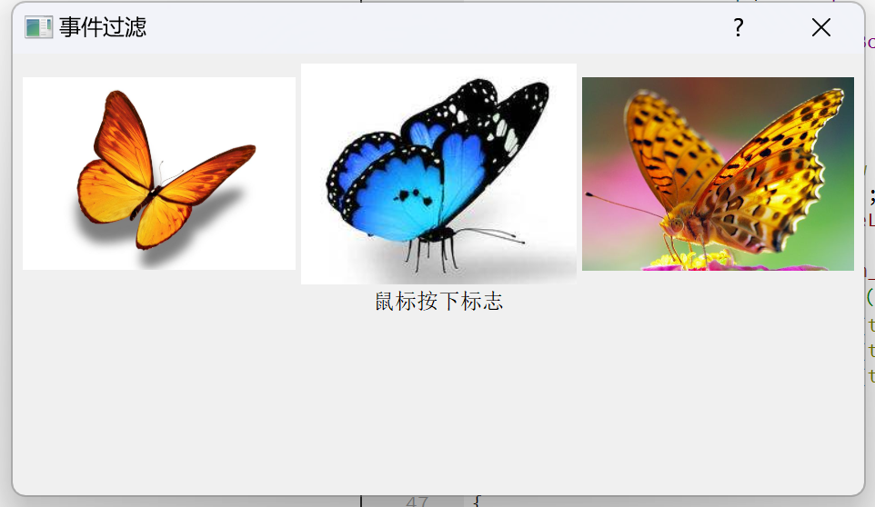

[toc]

# 事件过滤

事件过滤是当事件发生时，可以对不同对象，实现不同操作，以达到筛选的效果。

步骤：

1、首先安装一个事件过滤器

```cpp
//给m_label123安装事件过滤，指定(this)当前整个窗体监视我们的事件对象
m_label1->installEventFilter(this);
m_label2->installEventFilter(this);
m_label3->installEventFilter(this);
```

2、重写bool eventFilter([QObject](https://so.csdn.net/so/search?q=QObject&spm=1001.2101.3001.7020) *obj, QEvent *event)。

```cpp
//第一个参数是监视对象，第二个参数是事件
bool EventFilter::eventFilter(QObject *watched, QEvent *event)
{
    QMatrix matrix;
    QImage tmpImg;
    //放大图片
    matrix.scale(2.0,2.0);

    if(watched == m_label1)
    {
        //鼠标按下事件
        if(event->type() == QEvent::MouseButtonPress)
        {
            QMouseEvent* mouseEvent = (QMouseEvent*)event;
            if(mouseEvent->buttons()&Qt::LeftButton)
            {
                m_stateLabel->setText(QStringLiteral("左键按下图片1"));
            }
            if(mouseEvent->buttons()&Qt::MidButton)
            {
                m_stateLabel->setText(QStringLiteral("中键按下图片1"));
            }
            if(mouseEvent->buttons()&Qt::RightButton)
            {
                m_stateLabel->setText(QStringLiteral("右键按下图片1"));
            }

            tmpImg = m_image1.transformed(matrix);
            m_label1->setPixmap(QPixmap::fromImage(tmpImg));
        }

        if(event->type()==QEvent::MouseButtonRelease)
        {
            m_stateLabel->setText(QStringLiteral("鼠标释放图片1"));
            m_label1->setPixmap(QPixmap::fromImage(m_image1));
        }
    }
    else if(watched == m_label2)
    {
        //鼠标按下事件
        if(event->type() == QEvent::MouseButtonPress)
        {
            QMouseEvent* mouseEvent = (QMouseEvent*)event;
            if(mouseEvent->buttons()&Qt::LeftButton)
            {
                m_stateLabel->setText(QStringLiteral("左键按下图片2"));
            }
            if(mouseEvent->buttons()&Qt::MidButton)
            {
                m_stateLabel->setText(QString("中键按下图片2"));
            }
            if(mouseEvent->buttons()&Qt::RightButton)
            {
                m_stateLabel->setText(QString("右键按下图片2"));
            }

            tmpImg = m_image2.transformed(matrix);
            m_label2->setPixmap(QPixmap::fromImage(tmpImg));
        }

        if(event->type()==QEvent::MouseButtonRelease)
        {
            m_stateLabel->setText(QStringLiteral("鼠标释放图片2"));
            m_label2->setPixmap(QPixmap::fromImage(m_image2));
        }
    }
    else if(watched == m_label3)
    {
        //鼠标按下事件
        if(event->type() == QEvent::MouseButtonPress)
        {
            QMouseEvent* mouseEvent = (QMouseEvent*)event;
            if(mouseEvent->buttons()&Qt::LeftButton)
            {
                m_stateLabel->setText(QStringLiteral("左键按下图片3"));
            }
            if(mouseEvent->buttons()&Qt::MidButton)
            {
                m_stateLabel->setText(QStringLiteral("中键按下图片3"));
            }
            if(mouseEvent->buttons()&Qt::RightButton)
            {
                m_stateLabel->setText(QStringLiteral("右键按下图片3"));
            }

            tmpImg = m_image3.transformed(matrix);
            m_label3->setPixmap(QPixmap::fromImage(tmpImg));
        }

        if(event->type()==QEvent::MouseButtonRelease)
        {
            m_stateLabel->setText(QStringLiteral("鼠标释放图片3"));
            m_label3->setPixmap(QPixmap::fromImage(m_image3));
        }
    }

    //将事件交给上层对话框进行处理
    return QDialog::eventFilter(watched,event);
}

```

最终的实现效果就是👇(点击对应图片就会对图片进行放大，并且状态标签会进行提示)

