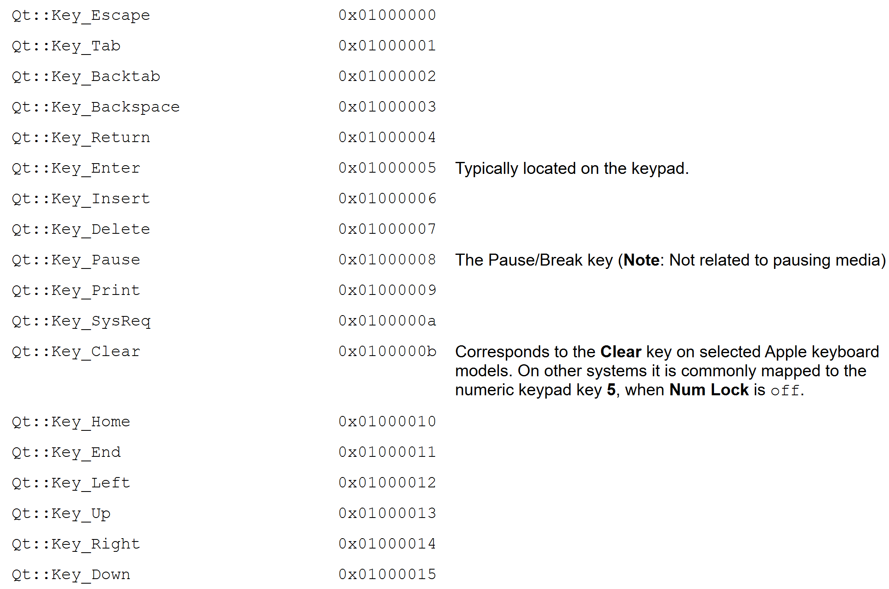
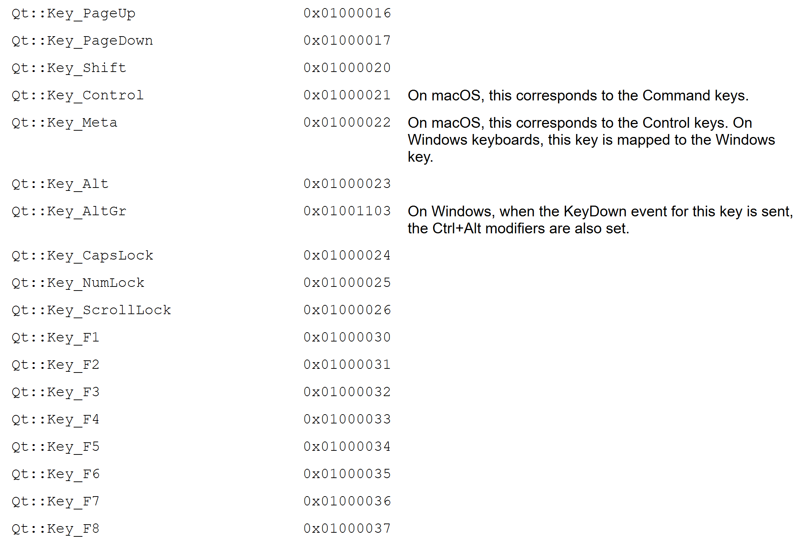

# Qt键盘事件

# 知识点

键盘事件触发是使用void keyPressEvent(QKeyEvent *event)来接收，键盘按键分为两种类型：`修饰键`以及`普通按键`

修饰键：

**Qt::NoModifier**：No modifier key is pressed.
**Qt::ShiftModifier**：A Shift key on the keyboard is pressed.
**Qt::ControlModifier**：A Ctrl key on the keyboard is pressed.
**Qt::AltModifier**：An Alt key on the keyboard is pressed.
**Qt::MetaModifier**：A Meta key on the keyboard is pressed.
**Qt::KeypadModifier**：A keypad button is pressed.
**Qt::GroupSwitchModifier**：X11 only (unless activated on Windows by a command line argument). A Mode_switch key on the keyboard is pressed.

普通按键：






# 键盘事件相关代码


```cpp
void KeyEvent::keyPressEvent(QKeyEvent *event)
{
    //如果按下ctrl修饰键的话
    if(event->modifiers()==Qt::ControlModifier)
    {
        if(event->key() == Qt::Key_Left)
        {
            m_startx = (m_startx - 1)<0 ? m_startx:m_startx - 1;
        }
        if(event->key() == Qt::Key_Right)
        {
            m_startx = (m_startx + 1 + m_image.width()) > m_width ? m_startx:m_startx + 1;
        }
        if(event->key() == Qt::Key_Up)
        {
            m_starty = (m_starty - 1 ) < 0 ? m_starty:m_starty - 1;
        }
        if(event->key() == Qt::Key_Down)
        {
            m_starty = (m_starty + 1 + m_image.height()) > m_height ? m_starty:m_starty + 1;
        }
    }
    else{
        //调整图片位置
        m_startx = m_startx - m_startx % m_step;
        m_starty = m_starty - m_starty % m_step;
        if(event->key() == Qt::Key_Left)
        {
            m_startx = (m_startx - m_step)<0 ? m_startx:m_startx - m_step;
        }
        if(event->key() == Qt::Key_Right)
        {
            m_startx = (m_startx + m_step + m_image.width()) > m_width ? m_startx:m_startx + m_step;
        }
        if(event->key() == Qt::Key_Up)
        {
            m_starty = (m_starty - m_step ) < 0 ? m_starty:m_starty - m_step;
        }
        if(event->key() == Qt::Key_Down)
        {
            m_starty = (m_starty + m_step + m_image.height()) > m_height ? m_starty:m_starty + m_step;
        }
    }
    //绘画界面
    drawPix();
    //触发PainterEvent，真真将m_pix画上去
    update();
}
```

