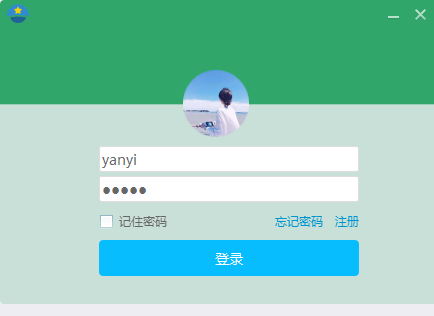
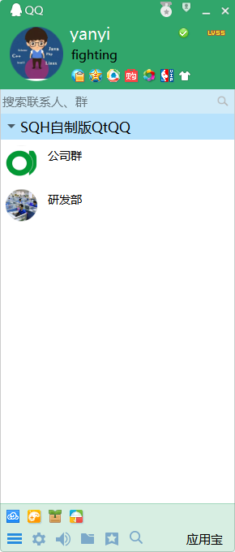
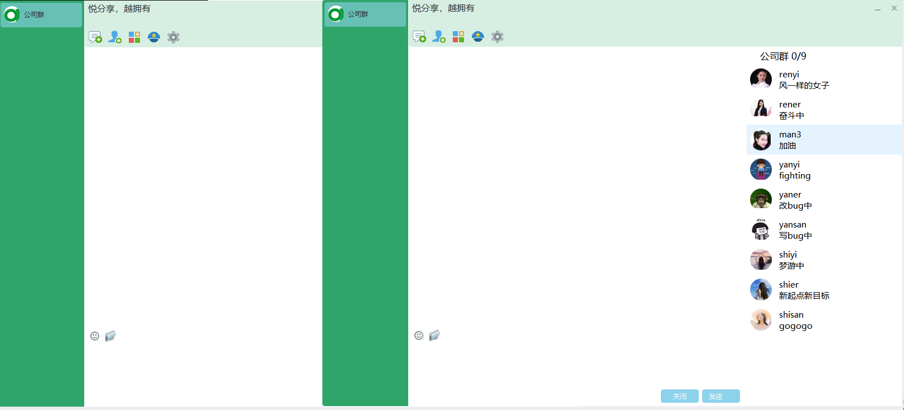
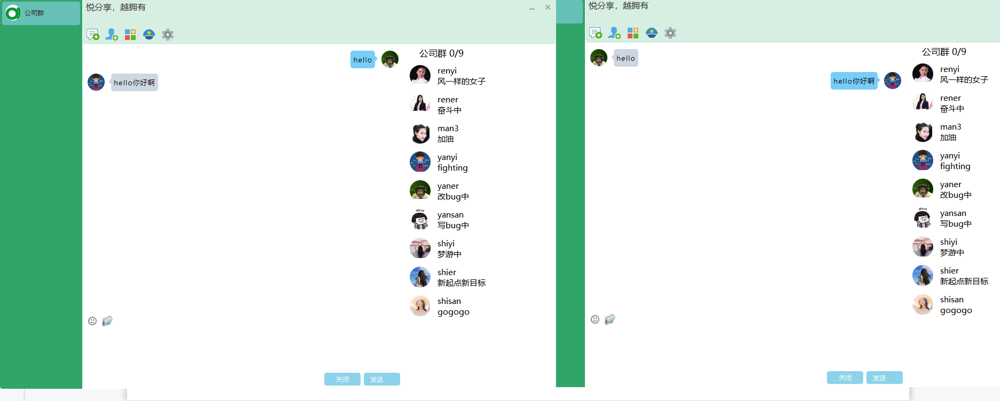
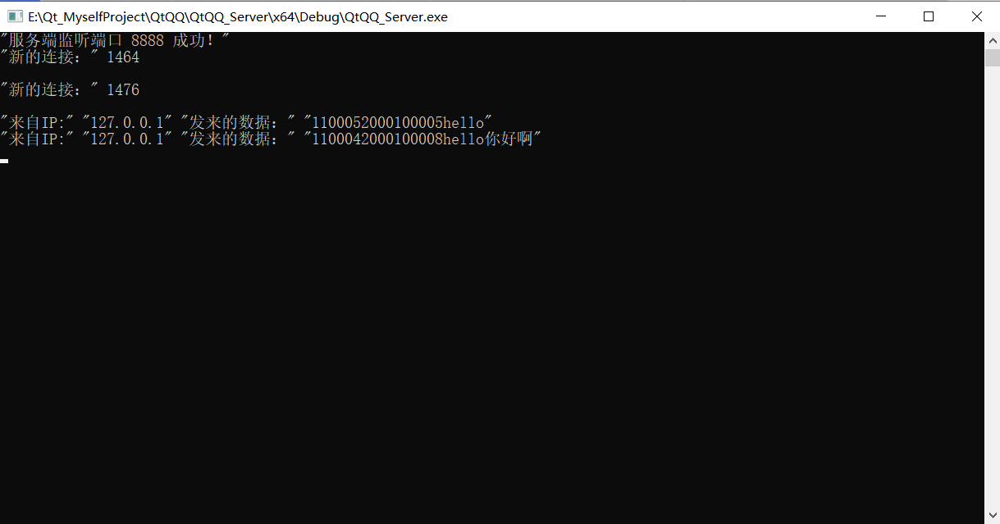
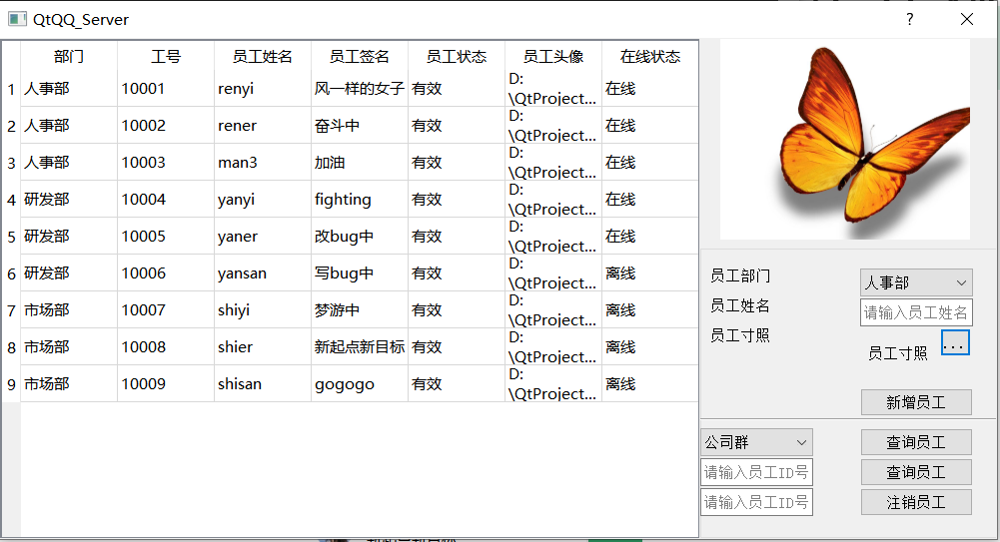

# 🚀Qt_ChattingSoftware
这是我的Qt和c++聊天软件，开发环境为vs2017 + qt5，本聊天软件可以实现`1.用户和用户之间的正常交流（包括文字+表情+发送文件）2.可以实时改变软件皮肤3.管理员可以删除和增加用户....`，除这些主要功能以外，本软件还使用了丰富的样式设计以及还有其他很多对于Qt的小知识点（比如系统托盘....）,相信通过对本项目的阅读和进一步开发可以帮助您很好的学习和掌握Qt的知识。

- QTQQ 是客户端
- QtQQ_Server 是服务器端
- Basic是此项目涉及到的各个知识点

# 🍎编译环境

0.win10

1.VS2017 x64

2.Qt5.12.1 MSVC 2017

3.MySQL 8.0.30

# 🎂编译注意事项
用到自己的环境中需要调整的地方

1.提示找不到工作集记得调整到自己已经下载好的

2.提示找不到Qt5Cored.dll等等dll时记得将项目属性——>Qt Project Setting中Qt Installation改成你自己的（我是msvc2017->QT5.12）

3.遇到error starting process /uic：
将项目属性——>链接器——>常规——>附加库目录加上$(QTDIR)\LIB

注意：本项目的Qt modules在项目属性——>Qt Project Setting——>Qt modules中可以编辑

4.数据库表中头像路径需要改成你的图像保存路径

# 🌰运行效果
`login`

`MainWindow`

`talkwindow`

`server`

# 声明
本软件只为学习使用，其中的图像以及软件中插件的布局很多参考深圳市腾讯计算机系统有限公司的QQ聊天软件版权归属于深圳市腾讯计算机系统有限公司
